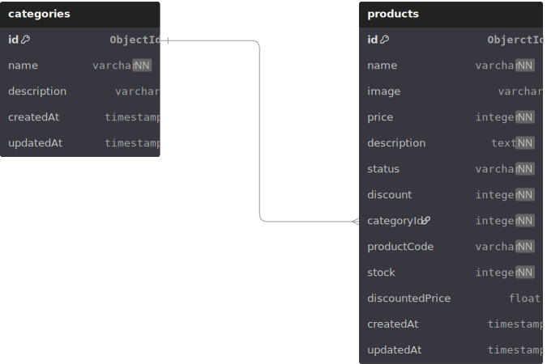

# My Products - A Simple NestJS Backend API

This is a backend API built using NestJS, TypeScript, and MongoDB. It was developed as part of a backend development challenge by [6sense Technologies](https://github.com/6sense-technologies). The application consists of two core models — Category and Product — and covers all the core requirements listed in the assignment using a clean, modular codebase.

---

## Tech Stack

- NestJS (Node.js Framework)
- TypeScript
- MongoDB (Mongoose)
- Swagger for auto-generated API documentation

---

## Features

### 1. Create a Product

You can create a product by providing the following details:
- Name
- Description
- Price
- Discount (percentage)
- Image (URL)
- Status (In Stock / Stock Out)
- Category (must be a valid one)

### 2. Auto-generated Product Code

When a product is created, the app auto-generates a unique product code based on the following logic:

- Find the **longest strictly increasing substring** from the product name.
- If multiple exist with the same length, concatenate them.
- Add the **start and end index** of that substring.
- Prefix the result with an **8-character hash** of the original product name.
- Final format: `<hashed product name>-<start_index><substring><end_index>`

Example for “Alpha Sorter”:
- Substrings: “alp” and “ort”
- Indexes: 0 and 8
- Hash: `p48asd4`
- Product Code: `p48asd4-0alport8`

This code is generated programmatically and is guaranteed to be unique.

### 3. Product ↔ Category Relationship

Every product must belong to a valid category. The product creation logic checks if the category exists and throws an error otherwise.

### 4. Update Product

The following product fields can be updated:
- Status
- Description
- Discount

### 5. Product Filtering & Search

Products can be retrieved using filters:
- Filter by category name
- Search by name (case-insensitive, partial match)
- All results return both the original price and the final price after discount

---

## Data Models

### Category
```ts
{
  _id: ObjectId,
  name: string
}
```

### Product
```ts
{
  _id: ObjectId,
  name: string,
  description: string,
  price: number,
  discount: number,
  category: ObjectId,
  image: string,
  productCode: string,
  status: string
}
```

---

## ER Diagram

A diagram showing the relationship between Category and Product models is included in the repository.



---

## How to Run Locally

1. Clone the repository:
```bash
git clone https://github.com/najmulhc/my-products.git
cd my-products-api
```

2. Install dependencies:
```bash
npm install
```

3. Create a `.env` file in the root directory with the following content:
```
MONGODB_URI=mongodb+srv://<your_credentials>
PORT=3000
```

4. Start the server:
```bash
npm run start:dev
```

Once the app is running, visit `http://localhost:3000/api` to access the Swagger UI.

---

## API Docs

Swagger documentation is enabled and auto-generated. You can test every endpoint, view request/response formats, and inspect the full structure directly from the Swagger UI.

---

## Notes

- Category deletion is restricted if any products exist under it.
- Errors and validations are handled using NestJS’s built-in exception system.
- Product code generation is custom-written to fulfill the unique substring + hash requirement.
- The app is designed to be clean, modular, and maintainable.

---

## Author

Najmul Huda Chowdhury t

Check out my other work at [GitHub](https://github.com/najmulhc)
